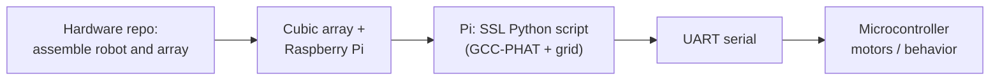
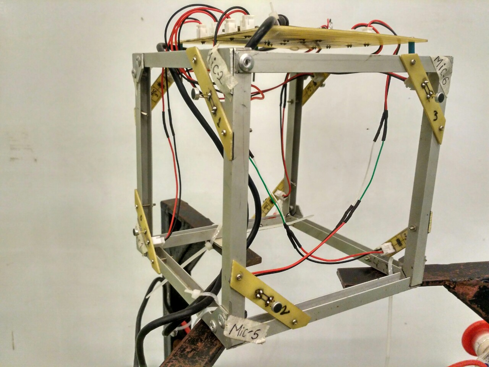

# Sound source localization

This project estimates **where a sound is coming from** in **3D** using a **cubical eight-microphone array**. It combines **GCC-PHAT** with a **grid search** over azimuth and elevation. Audio is processed at **16 kHz** on a **Raspberry Pi**; estimated angles are sent over **serial** to a **microcontroller**, which handles low-level **motion and control** of the robot.

The **mechanical parts, electronics, and firmware** for the physical robot live in a separate hardware repository. This repository is focused on **software**: real-time localization scripts plus **optional** notebooks and experiments you can use for **testing, calibration, and research** without changing the main pipeline.

---

- **Hardware (build the robot):** [Sound-Source-Localization-Hardware](https://github.com/subash-timilsina/Sound-Source-Localization-Hardware)
- **Paper (open PDF):** [ISCRAM 2020 PDF](http://idl.iscram.org/files/abhishkhanal/2020/2293_AbhishKhanal_etal2020.pdf)
- If you **do not** wish to build the robot and only need the **software and testing**, see **[Running the main SSL pipeline](#running-the-main-ssl-pipeline)** (use the desktop scripts for bench runs without the physical robot).

---

## What you are building, end to end

Think of the system in three layers: **sensors**, **compute**, and **actuation**.

1. **Robot and array (hardware repository)**  
   You assemble the mobile platform, power, motor drivers, microcontroller, and the **cubic microphone frame** so that eight microphone channels reach the computer that will run Python.

2. **Sound localization (this repository, on the Raspberry Pi)**  
   The Pi captures **eight channels** (today’s scripts assume two **four-input** audio devices, or equivalent routing). It runs **GCC-PHAT** and a **spherical grid search** to produce **azimuth** and **elevation** estimates for the dominant source.

3. **Motion (microcontroller)**  
   The Pi does **not** replace the MCU for motor timing. It sends **UART packets** with the estimated angles. Your **firmware** on the microcontroller decodes those bytes and drives the robot (wheels, servos, etc.) according to your control logic.

So: **build the robot from the hardware repo → mount the Pi and cube array → run the Pi script → the Pi streams angle updates to the MCU**, which closes the loop to the physical world.



---

## Figures

Pictures in [`pics/`](pics/) illustrate the **sensor head** and the **full robot** you integrate with the pipeline above.

| File | What it shows |
|------|----------------|
| [`pics/cube_array.jpg`](pics/cube_array.jpg) | The **cubical microphone array**: rigid frame, microphone boards, and wiring into the interface that feeds the Pi. |
| [`pics/Robot.jpg`](pics/Robot.jpg) | The **complete mobile platform**: Pi, batteries, motor electronics, emergency stop, and the elevated structure carrying the array. |

**Cubic microphone array** (eight channels in a fixed geometry, feeding the localization code):



**Mobile robot** (Pi + MCU + mechanics; the Pi runs SSL and talks to the MCU over serial):


---

## Running the main SSL pipeline

All **production-style** real-time runners live at the **repository root**. You edit **device indices**, and on the Pi **serial port and baud**, inside the files listed below.

| Role | Script | Notes |
|------|--------|--------|
| **Raspberry Pi + robot** (energy gate, **UART** to MCU) | `python Grid_Real_time_raspberrypi.py` | Use this after you assemble hardware: captures audio, estimates direction, **writes angles to serial**. Adjust `serial.Serial(...)` (e.g. `/dev/ttyS0`, baud `9600`) and **`device_index1` / `device_index2`** for your two four-channel interfaces. |
| **Desktop / lab** (terminal output, **WebRTC VAD**) | `python Grid_Real_time.py` | Handy for **bench testing** the same DSP path without the robot serial link. |
| **Desktop / lab** (live **3D plot**) | `python Grid_Real_time_GUI.py` | Same core idea with a **matplotlib** view of the estimated direction. |

**Finding audio devices:** set `device_index1` and `device_index2` in the script to match PyAudio (or use helper notebooks under `Initial Codes/` if you need to enumerate devices interactively).

**Microcontroller side:** the Pi script uses a **start byte** and **custom packing** in `write_data()` when it sends azimuth and elevation. Your **MCU firmware must match** that format so angles are interpreted correctly.

**Dependencies (typical):** Python 3, `numpy`, `scipy`, `pyaudio`; for desktop scripts also `webrtcvad`, and for the GUI `matplotlib`; for the Pi runner **`pyserial`**. Install `soundfile` if you use code paths that require it.

---

## Other folders (optional — testing and exploration)

These directories are **not required** to run `Grid_Real_time_raspberrypi.py` on the robot. They are **older or parallel work**: notebooks, prototypes, and datasets useful for **debugging microphones, trying other algorithms, or analyzing recordings**.

| Folder | Purpose |
|--------|--------|
| **`Initial Codes/`** | Early **GCC-PHAT** experiments: **4-mic** and **8-mic** scripts and notebooks, **VAD**, live streaming, grid search prototypes, and small utilities (e.g. listing input devices). Good for **step-by-step testing** of audio hardware and correlation behavior before trusting the full robot loop. |
| **`MUSIC SSL/`** | Experiments with the **MUSIC** direction-finding family (**notebooks** and scripts). Independent of the default GCC-PHAT grid pipeline; useful if you want to **compare methods** or teach array processing. |
| **`Denoising and VAD/`** | **Speech vs. non-speech** classifiers (**CNN / RNN** notebooks), **denoising** models (U-Net, ResNet, CED), and preprocessing notebooks. Relevant when you care about **front-end robustness** or labeling data—not wired into the default real-time SSL scripts. |
| **`Data_From_cube/`** | Notebooks working with **recorded data** from the cube-style array (e.g. analysis and tests on saved captures rather than only live input). |
| **`Data with ps3eye/`** | Capture / organization experiments involving a **PS3 Eye**; useful for **camera–audio** or data-collection workflows, separate from the core SSL runner. |
| **`pics/`** | **Figures** for documentation (see above). |
| **`LICENSE`** | License terms for this repository. |

Together, these folders support **development and validation**. The **minimal path on the real robot** remains: hardware from the companion repo, then **`Grid_Real_time_raspberrypi.py`** on the Pi with correct audio and serial settings.

---

### Citation

If you use this work, please cite the ISCRAM 2020 proceedings paper. BibTeX:

```bibtex
@inproceedings{AbhishKhanal_etal2020,
  author    = {Khanal, Abhish and Chand, Deepak and Chaudhary, Prakash and Timilsina, Subash and Panday, Sanjeeb Prasad and Shakya, Aman and others},
  title     = {Search Disaster Victims using Sound Source Localization},
  booktitle = {ISCRAM 2020 Conference Proceedings -- 17th International Conference on Information Systems for Crisis Response and Management},
  editor    = {Hughes, Amanda and McNeill, Fiona and Zobel, Christopher W.},
  pages     = {1022--1030},
  year      = {2020},
  address   = {Blacksburg, VA, USA},
  publisher = {Virginia Tech}
}
```

## Demo video

The walkthrough is on YouTube: [watch the demo](https://www.youtube.com/watch?v=Y1u37uJwSeI).

[](https://www.youtube.com/watch?v=Y1u37uJwSeI)

## License

See the [`LICENSE`](LICENSE) file in this repository.
